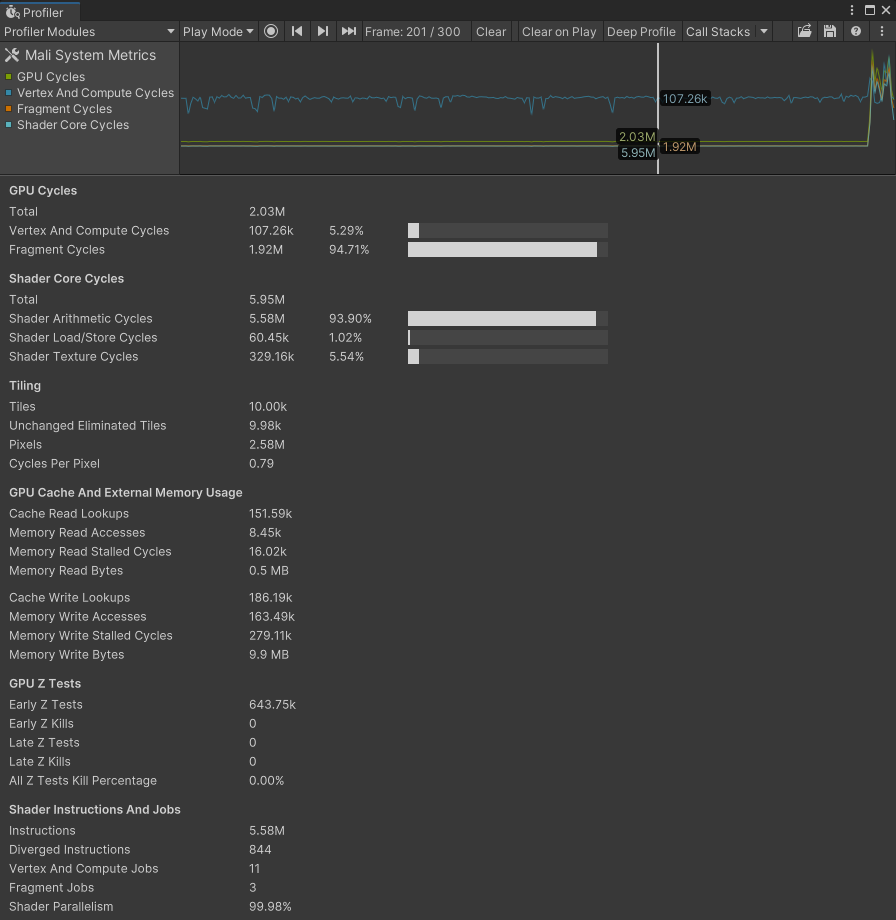

# About System Metrics Mali
The System Metrics Mali package allows you to access low-level system or hardware performance metrics on mobile devices for profiling or runtime performance adjustments. For example, you could use the package to:
- Monitor low-level GPU metrics in Unity Profiler to assess performance bottlenecks.
- Access the same metrics using Recorder API in runtime and adjust graphics quality based on the current bottleneck.
- Automate performance testing, by collecting extensive performance measurements with your continuous integration test runs.

The System Metrics Mali package includes a Profiler Module for monitoring low-level GPU metrics in the Unity Profiler window.
<br/>*Mali System Metrics Profiler Module.*

## Installation

You can install the package in one of the following ways:

- From the [Unity Package Manager](#unity-package-manager)
- Manually from the [Package Manifest](#package-manifest)

### Unity Package Manager

Use the [Unity Package Manager](https://docs.unity3d.com/Packages/com.unity.package-manager-ui@latest/index.html) to install the System Metrics Mali package.


### Package manifest

You can also install System Metrics Mali manually. To do this, add a reference to System Metrics Mali in your Project's `Packages/manifest.json` file. There are two ways you can reference a specific version of the System Metrics Mali package, depending on how you use it.

#### Using a released version of the package

You can point the Package Manager at a publicly available version. To do this manually, add it to `manifest.json`:

```json
    "dependencies": {
        //...
        "com.unity.systemmetrics":"<full version number>"
    }
```

#### Using a local clone of the package

If you want to use a cloned version of the package, you can point the Package Manager at a local folder as the package location:

```json
    "dependencies": {
        //...
        "com.unity.systemmetrics":"file:path/to/package/root"
    }
```

**Note:** The root of the package folder isn't necessarily the root of the cloned repository. The root of the package folder is the folder that contains the `package.json` file.
