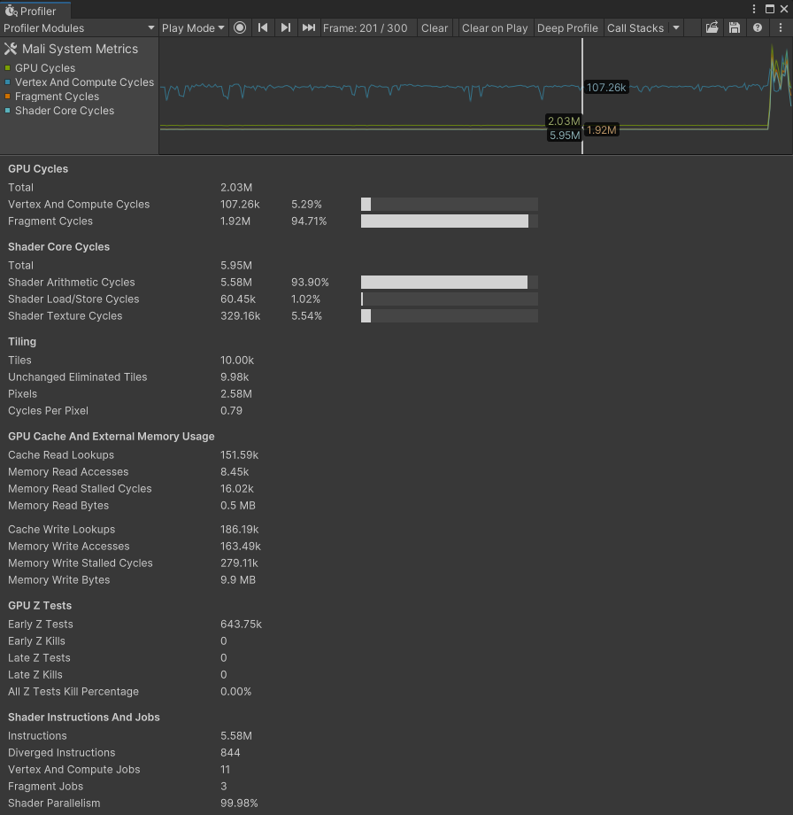
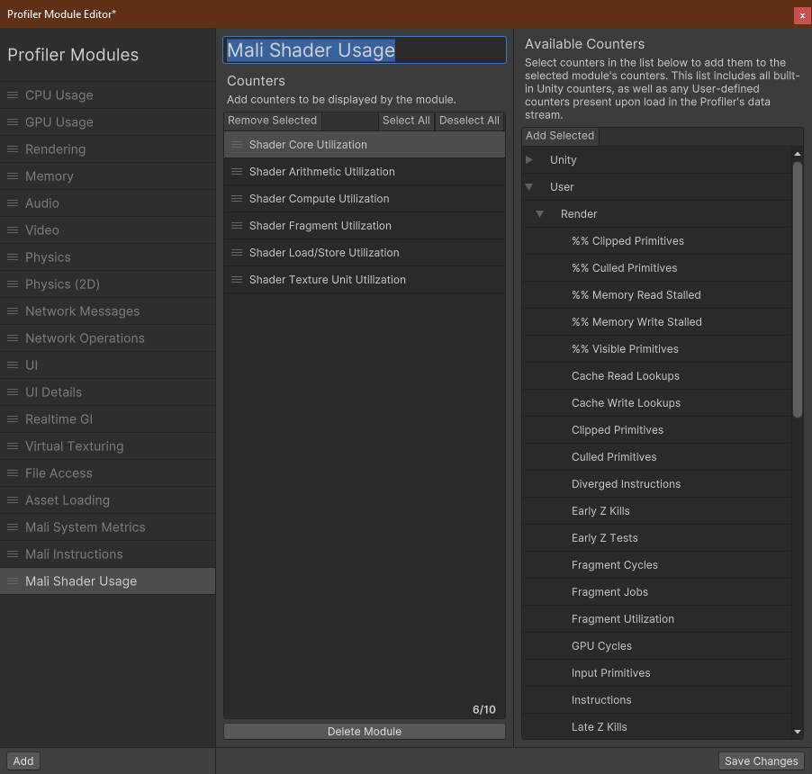
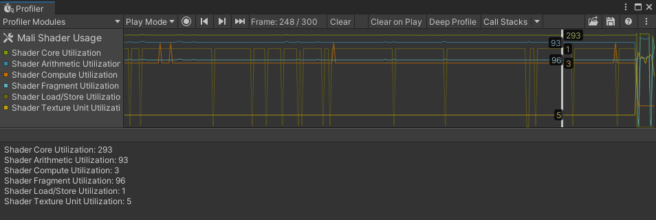
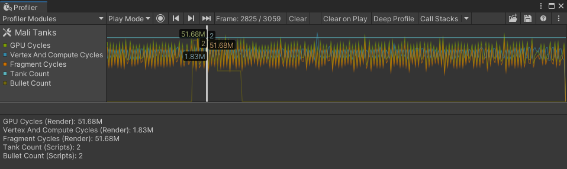

# Usage Guide

## Profiler Module
The System Metrics Mali package includes a Profiler Module for monitoring low-level GPU metrics in the Unity Profiler window.

<br/>*Mali System Metrics Profiler Module.*

> After installing the package, the Mali System Metrics Profiler module will be available in the Profiler window. If it is not visible, you can enable it from the modules dropdown in the Profiler window.

The Mali System Metrics module uses its chart view to display a high level overview of where the GPU processing load was spent.

In the module’s Details view, you can see more detailed information about the currently selected frame, such as information about Tiling, Memory Usage, Z Tests, and Shader Instructions. For descriptions of the individual counters, hover over their name to see a tooltip or refer to the [Metrics Guide](metrics-guide.md).

## Module Editor
Using the [Module Editor](https://docs.unity3d.com/Manual/profiler-module-editor.html), you can quickly build custom Profiler modules directly in the Editor that use the Mali stats. This allows you, for example, to display additional Mali metrics in a Profiler chart, including alongside other built-in or custom Profiler counters.

<br/>*Module Editor.*

> If you don't see the Mali counters in the list of **Available Counters**, ensure that the Profiler is connected to a Mali device and has captured Profiling data prior to opening the Module Editor.

<br/>*Module Editor Module.*

> Note that modules created via the Module Editor are not part of the Project and will therefore only appear in your local Editor. To define a custom Profiler module in the Project, which makes it available for all Project users, please see [Custom Profiler Module](#custom-profiler-module) below.

## Custom Profiler Module
Using the [Profiler Extensibility API](https://docs.unity3d.com/Manual/customizing-profiler-module.html), you can define a custom Profiler module that uses the Mali counters. This allows you, for example, to mix-and-match the Mali metrics with other built-in or custom Profiler counters in one module, or to implement some bespoke visualization using the Mali performance data.

The below example shows how you might combine the Mali metrics with custom [Profiler Counters](https://docs.unity3d.com/Packages/com.unity.profiling.core@latest/index.html?subfolder=/manual/profilercounter-guide.html) to correlate the metrics on a single chart.

<br/>*Custom Profiler Module.*

```c#
using Unity.Profiling.Editor;
using Unity.Profiling.LowLevel.Unsafe;
using Unity.Profiling.SystemMetrics;

[ProfilerModuleMetadata("Mali Tanks")]
public class MaliTanksProfilerModule : ProfilerModule
{
    static readonly ProfilerCounterDescriptor[] k_ChartCounters =
    {
        GetDescriptorProfilerCounterHandle(SystemMetricsMali.Instance.GpuCycles),
        GetDescriptorProfilerCounterHandle(SystemMetricsMali.Instance.GpuVertexAndComputeCycles),
        GetDescriptorProfilerCounterHandle(SystemMetricsMali.Instance.GpuFragmentCycles),
        new ProfilerCounterDescriptor("Tank Count", Complete.GameStats.TanksProfilerCategory.Name),
        new ProfilerCounterDescriptor("Bullet Count", Complete.GameStats.TanksProfilerCategory.Name),
    };

    public MaliTanksProfilerModule() : base(k_ChartCounters) { }

    static ProfilerCounterDescriptor GetDescriptorProfilerCounterHandle(ProfilerRecorderHandle handle)
    {
        var description = ProfilerRecorderHandle.GetDescription(handle);
        return new ProfilerCounterDescriptor(description.Name, description.Category);
    }
}
```

Please see the [Profiler Extensibility documentation](https://docs.unity3d.com/Manual/customizing-profiler-module.html) for more information.

## Scripting API Usage
All metrics in the System Metrics Mali package are implemented as [Profiler Counters](https://docs.unity3d.com/Packages/com.unity.profiling.core@latest/index.html?subfolder=/manual/profilercounter-guide.html) and can therefore be obtained from script via the [ProfilerRecorder API](https://docs.unity3d.com/ScriptReference/Unity.Profiling.ProfilerRecorder.html).

The below example shows how you might use the [ProfilerRecorder API](https://docs.unity3d.com/ScriptReference/Unity.Profiling.ProfilerRecorder.html) to monitor some Mali metrics in-game by displaying them on the screen, including from within a Release build without the Profiler attached.

<br/>*In-game display.*

```c#
using System.Collections.Generic;
using System.Text;
using Unity.Profiling;
using Unity.Profiling.LowLevel.Unsafe;
using Unity.Profiling.SystemMetrics;
using UnityEngine;

public class MaliHUD : MonoBehaviour
{
    List<HUDEntry> m_Entries;
    string m_Text;
    GUIStyle m_TextStyle;
    StringBuilder m_TextBuilder;

    void Awake()
    {
        m_TextBuilder = new StringBuilder(500);
        m_Entries = new List<HUDEntry>()
        {
            new HUDEntry(SystemMetricsMali.Instance.GpuShaderCoreCycles),
            new HUDEntry(SystemMetricsMali.Instance.GpuShaderArithmeticCycles),
            new HUDEntry(SystemMetricsMali.Instance.GpuShaderLoadStoreCycles),
            new HUDEntry(SystemMetricsMali.Instance.GpuShaderTextureCycles),
        };
    }

    void OnEnable()
    {
        foreach (var entry in m_Entries)
            entry.Recorder.Start();
    }

    void OnDisable()
    {
        foreach (var entry in m_Entries)
            entry.Recorder.Dispose();
    }

    void Update()
    {
        m_TextBuilder.Clear();

        foreach (var entry in m_Entries)
        {
            var value = entry.Recorder.LastValue;
            m_TextBuilder.AppendLine($"{entry.Name}: {FormatCount(value)}");
        }

        m_Text = m_TextBuilder.ToString();
    }

    void OnGUI()
    {
        if (m_TextStyle == null)
            m_TextStyle = new GUIStyle(GUI.skin.label) { fontSize = 42 };

        GUILayout.Label(m_Text, m_TextStyle);
    }

    static string FormatCount(in long count)
    {
        if (count < 1000)
            return string.Format("{0:D}", count);
        else if (count < 1000000) // 1e6
            return string.Format("{0:F2}k", count * 1.0e-3);
        else
            return string.Format("{0:F2}M", count * 1.0e-6);
    }

    struct HUDEntry
    {
        public HUDEntry(ProfilerRecorderHandle handle)
        {
            Recorder = new ProfilerRecorder(handle);
            if (!Recorder.Valid)
                throw new System.ArgumentException();

            var description = ProfilerRecorderHandle.GetDescription(handle);
            Name = description.Name;
        }

        public string Name { get; }
        public ProfilerRecorder Recorder { get; }
    }
}
```
