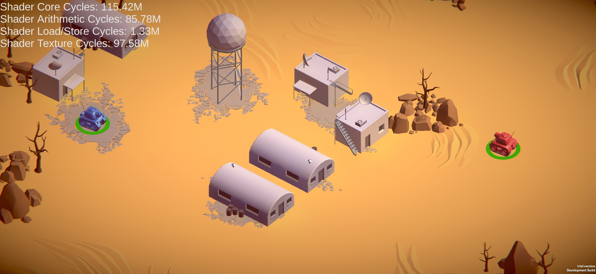

# Using System Metrics Mali

## View data through the preconfigured Profiler module

The System Metrics Mali package includes a Profiler module to monitor low-level GPU metrics in the Unity Profiler window.

The chart view in the System Metrics Mali Profiler Module displays a high level overview of how the GPU distributed its processing load.

In the module’s Details view, you can see more detailed information about the currently selected frame, such as information about Tiling, Memory Usage, Z Tests, and Shader Instructions. For descriptions of the individual counters, hover over their name to see a tooltip or see [Metrics Guide](metrics-guide.md).

## Build a customized module in the Module Editor

Use the [Profiler Module Editor](https://docs.unity3d.com/Manual/profiler-module-editor.html) to build Profiler modules directly in the Editor that use the Mali stats. This module can display additional Mali metrics in a Profiler chart, alongside other built-in or custom Profiler counters.

Connect the Profiler to a Mali GPU device and [capture some profiling data](https://docs.unity3d.com/Manual/profiler-profiling-applications.html) before you open the Profiler Module Editor. If you open the Profiler Module Editor window first, the Mali metrics counters don't appear in the **Available Counters** menu.

> Modules you create with the Module Editor aren't part of your Unity project and only appear in your local Editor. To define a custom Profiler Module that's available for all project users, see [Custom Profiler Module](#custom-profiler-module).

<br/>*The Mali Shader Usage module.*

> Note that modules created via the Module Editor are not part of the Project and will therefore only appear in your local Editor. To define a custom Profiler module in the Project, which makes it available for all Project users, please see [Custom Profiler Module](#custom-profiler-module) below.

<a name="custom-profiler-module"></a>

## Create a new Custom Profiler Module

Use the [Profiler Extensibility API](https://docs.unity3d.com/Manual/customizing-profiler-module.html) to define a custom Profiler module that uses the Mali counters. You can use this to mix-and-match the Mali metrics with other built-in or custom Profiler counters in one module, or to implement some bespoke visualization using the Mali performance data.

The following example uses the Mali metrics alongside custom [Profiler Counters](https://docs.unity3d.com/Packages/com.unity.profiling.core@latest/index.html?subfolder=/manual/profilercounter-guide.html) to correlate the metrics on a single chart.

<br/>*Custom Profiler Module.*

```c#
using Unity.Profiling.Editor;
using Unity.Profiling.LowLevel.Unsafe;
using Unity.Profiling.SystemMetrics;

[ProfilerModuleMetadata("Mali Tanks")]
public class MaliTanksProfilerModule : ProfilerModule
{
    static readonly ProfilerCounterDescriptor[] k_ChartCounters =
    {
        GetDescriptorProfilerCounterHandle(SystemMetricsMali.Instance.GpuCycles),
        GetDescriptorProfilerCounterHandle(SystemMetricsMali.Instance.GpuVertexAndComputeCycles),
        GetDescriptorProfilerCounterHandle(SystemMetricsMali.Instance.GpuFragmentCycles),
        new ProfilerCounterDescriptor("Tank Count", Complete.GameStats.TanksProfilerCategory.Name),
        new ProfilerCounterDescriptor("Bullet Count", Complete.GameStats.TanksProfilerCategory.Name),
    };

    public MaliTanksProfilerModule() : base(k_ChartCounters) { }

    static ProfilerCounterDescriptor GetDescriptorProfilerCounterHandle(ProfilerRecorderHandle handle)
    {
        var description = ProfilerRecorderHandle.GetDescription(handle);
        return new ProfilerCounterDescriptor(description.Name, description.Category);
    }
}
```

## Access the Profiler counters through code

The System Metrics Mali package implements all of its metrics as [Profiler Counters](https://docs.unity3d.com/Packages/com.unity.profiling.core@latest/index.html?subfolder=/manual/profilercounter-guide.html). You can access them through a script using the [ProfilerRecorder API](https://docs.unity3d.com/ScriptReference/Unity.Profiling.ProfilerRecorder.html).

The following example uses the [ProfilerRecorder API](https://docs.unity3d.com/ScriptReference/Unity.Profiling.ProfilerRecorder.html) to display some Mali metrics in-game on the screen, including from within a Release build without the Profiler attached.

<br/>*In-game display.*

```csharp
using System.Collections.Generic;
using System.Text;
using Unity.Profiling;
using Unity.Profiling.LowLevel.Unsafe;
using Unity.Profiling.SystemMetrics;
using UnityEngine;

public class MaliHUD : MonoBehaviour
{
    List<HUDEntry> m_Entries;
    string m_Text;
    GUIStyle m_TextStyle;
    StringBuilder m_TextBuilder;

    void Awake()
    {
        m_TextBuilder = new StringBuilder(500);
        m_Entries = new List<HUDEntry>()
        {
            new HUDEntry(SystemMetricsMali.Instance.GpuShaderCoreCycles),
            new HUDEntry(SystemMetricsMali.Instance.GpuShaderArithmeticCycles),
            new HUDEntry(SystemMetricsMali.Instance.GpuShaderLoadStoreCycles),
            new HUDEntry(SystemMetricsMali.Instance.GpuShaderTextureCycles),
        };
    }

    void OnEnable()
    {
        foreach (var entry in m_Entries)
            entry.Recorder.Start();
    }

    void OnDisable()
    {
        foreach (var entry in m_Entries)
            entry.Recorder.Dispose();
    }

    void Update()
    {
        m_TextBuilder.Clear();

        foreach (var entry in m_Entries)
        {
            var value = entry.Recorder.LastValue;
            m_TextBuilder.AppendLine($"{entry.Name}: {FormatCount(value)}");
        }

        m_Text = m_TextBuilder.ToString();
    }

    void OnGUI()
    {
        if (m_TextStyle == null)
            m_TextStyle = new GUIStyle(GUI.skin.label) { fontSize = 42 };

        GUILayout.Label(m_Text, m_TextStyle);
    }

    static string FormatCount(in long count)
    {
        if (count < 1000)
            return string.Format("{0:D}", count);
        else if (count < 1000000) // 1e6
            return string.Format("{0:F2}k", count * 1.0e-3);
        else
            return string.Format("{0:F2}M", count * 1.0e-6);
    }

    struct HUDEntry
    {
        public HUDEntry(ProfilerRecorderHandle handle)
        {
            Recorder = new ProfilerRecorder(handle);
            if (!Recorder.Valid)
                throw new System.ArgumentException();

            var description = ProfilerRecorderHandle.GetDescription(handle);
            Name = description.Name;
        }

        public string Name { get; }
        public ProfilerRecorder Recorder { get; }
    }
}
```
